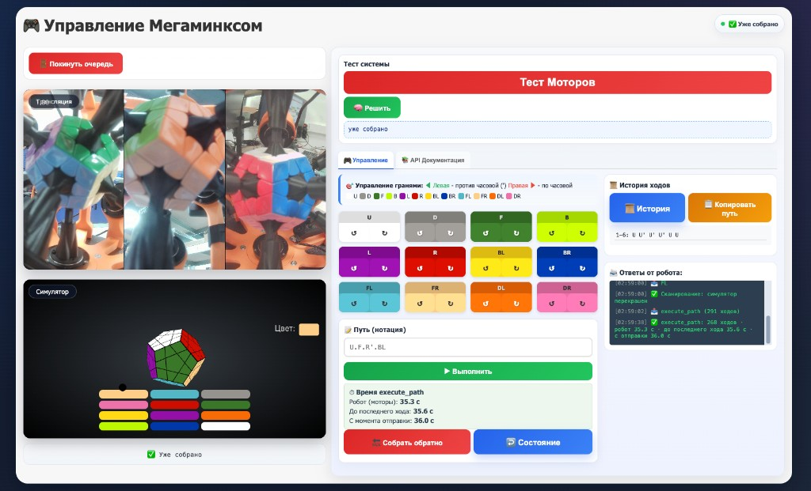

# WebRTC Megaminx — управление роботом онлайн

Стек для **трансляции** с камер робота, **очереди зрителей**, **управления гранями** через браузер, **3D-симулятора** и **HTTP/Jupyter API**.

Продакшен: [https://roborubiks.ru](https://roborubiks.ru)



---

## Архитектура

```
┌─────────────────┐     WebRTC video      ┌──────────────────┐
│  Viewer         │◄──────────────────────│  robot/          │
│  (браузер)      │     Socket.IO         │  robot_streamer  │
│  viewer.html    │──────────────────────►│  (ПК робота)     │
└────────┬────────┘   команды / ответы    └────────┬─────────┘
         │                                          │ WS :8765
         │ HTTPS / Socket.IO                        ▼
         ▼                                 ┌──────────────────┐
┌─────────────────┐                        │  robot/online.py │
│  server.js      │◄─── Socket.IO ─────────│  моторы / sim    │
│  Node :3000     │     (broadcaster)      └──────────────────┘
│  nginx :443     │
└────────┬────────┘
         │ HTTP API
         ▼
┌─────────────────┐
│  Jupyter /      │
│  megaminx_client│
└─────────────────┘
```

**Важно:** команды от viewer и от Jupyter идут **одним путём** через `robot/robot_streamer.py` → `robot/online.py`. Симулятор в iframe синхронизируется с роботом по progress-сообщениям.

---

## Структура репозитория

| Путь | Назначение |
|------|------------|
| `server.js` | Node: статика, очередь зрителей, WebRTC-сигналинг, HTTP API |
| `public/viewer.html` | UI зрителя (видео + симулятор + управление) |
| `public/viewer-app.js` | Логика viewer, Socket.IO, синхронизация симулятора |
| `public/viewer-config.js` | Цвета кнопок граней, motor_id (справочно) |
| **`robot/`** | **Код для ПК робота** (см. [`robot/README.md`](robot/README.md)) |
| `robot/online.py` | WebSocket API робота, моторы, история ходов |
| `robot/robot_streamer.py` | Камеры → WebRTC + мост команд на `online.py` |
| `robot/megaminx.py` | Драйвер моторов MG4005 (USB serial) |
| `MegaMinx/` | React-симулятор (исходники) |
| `public/MegaMinx/` | Собранный симулятор для iframe |
| `megaminx_client.py` | Python HTTP-клиент для Jupyter/скриптов |
| `notebooks/megaminx_api.ipynb` | Примеры всех API-методов |
| `public/api-docs.html` | Страница `/api` — ссылка на Jupyter notebook |

---

## Быстрый старт (локально)

### 1. Сервер (Node)

```bash
cd webrtc-queue
npm install
node server.js
# → http://localhost:3000
```

### 2. Робот (Python, без USB — симуляция)

```bash
cd robot
python3 online.py --sim
# → ws://127.0.0.1:8765
```

### 3. Стример (на машине с камерами или без — для теста)

```bash
python3 -m venv .venv-streamer
source .venv-streamer/bin/activate
pip install -r scripts/requirements-streamer.txt

export ROBORUBIKS_URL=http://localhost:3000
export PYTHON_WS_URL=ws://127.0.0.1:8765
# export CAMERA_IDS=0,1,2   # опционально

cd robot
python3 robot_streamer.py
```

### 4. Viewer

Откройте [http://localhost:3000/viewer.html](http://localhost:3000/viewer.html) → **Встать в очередь**.

---

## Продакшен: удалённый сервер (VPS)

На сервере (например `130.49.143.78` / `roborubiks.ru`) крутится **только Node + nginx**. Робот и камеры — на **отдельном ПК**.

### Требования VPS

- Ubuntu 20.04+
- Node.js 18+
- nginx + SSL (Let's Encrypt)
- **coturn** (TURN для WebRTC за NAT) — порт 3478

### Установка на VPS

```bash
git clone https://github.com/poleschukfa/MegaminxRobot.git /root/webrtc-queue
cd /root/webrtc-queue
npm install
npm run build:simulator   # собрать симулятор в public/MegaMinx/
```

### Запуск Node

```bash
cd /root/webrtc-queue
PORT=3000 node server.js
# или через pm2:
pm2 start server.js --name webrtc-queue
pm2 save
```

Проверка:

```bash
curl http://127.0.0.1:3000/health
# {"status":"ok","broadcaster":...,"activeViewer":...,"apiVersion":2,...}
```

### nginx (пример)

```nginx
server {
    listen 443 ssl;
    server_name roborubiks.ru;

    ssl_certificate     /etc/letsencrypt/live/roborubiks.ru/fullchain.pem;
    ssl_certificate_key /etc/letsencrypt/live/roborubiks.ru/privkey.pem;

    location / {
        proxy_pass http://127.0.0.1:3000;
        proxy_http_version 1.1;
        proxy_set_header Upgrade $http_upgrade;
        proxy_set_header Connection "upgrade";
        proxy_set_header Host $host;
        proxy_set_header X-Real-IP $remote_addr;
        proxy_read_timeout 600s;   # длинные execute_path через HTTP
    }
}
```

После изменений:

```bash
sudo nginx -t && sudo systemctl reload nginx
```

### TURN (coturn)

WebRTC не работает без TURN, если зритель или робот за NAT. На VPS:

```bash
sudo apt install coturn
```

`/etc/turnserver.conf` (фрагмент):

```ini
listening-port=3478
fingerprint
lt-cred-mech
user=roborubiks:YOUR_TURN_PASSWORD
realm=roborubiks.ru
```

Пароль задайте в `.env` на сервере (`TURN_PASSWORD`) — тот же, что в `/etc/turnserver.conf`.

```bash
sudo systemctl enable coturn && sudo systemctl start coturn
```

Учётные данные TURN отдаются клиентам через `GET /api/webrtc/ice` (из переменных окружения, не из репозитория).

### Деплой обновлений на VPS

```bash
cd /root/webrtc-queue
git pull
npm run build:simulator   # если менялся MegaMinx/
pm2 restart webrtc-queue
# жёсткое обновление viewer у пользователей: Ctrl+Shift+R
```

---

## ПК робота (рядом с механикой)

На этом компьютере: **USB моторы**, **камеры**, `robot/online.py`, `robot/robot_streamer.py`.

### Зависимости Python

```bash
cd webrtc-queue
python3 -m venv .venv-robot
source .venv-robot/bin/activate

cd robot
# online.py — websockets, opencv, pyserial; megaminx.py — локальный модуль
pip install websockets opencv-python numpy pyserial

# streamer (отдельное venv или то же)
pip install -r ../scripts/requirements-streamer.txt
```

Драйвер моторов: `robot/megaminx.py` (MG4005), порт — `MEGAMINX_PORT` или по умолчанию в коде.

### 1. Запуск контроллера робота

```bash
cd robot

# Реальный робот:
python3 online.py --robot

# Или через переменную окружения:
MEGAMINX_USE_ROBOT=1 python3 online.py

# Только симуляция (без USB):
python3 online.py --sim
```

Слушает **`ws://127.0.0.1:8765`** (только localhost — снаружи не открывать).

Переменные окружения:

| Переменная | По умолчанию | Описание |
|------------|--------------|----------|
| `MEGAMINX_USE_ROBOT` | `0` | `1` — реальные моторы |
| `MEGAMINX_WS_PING_INTERVAL` | `20` | Ping WebSocket (с) |
| `MEGAMINX_WS_PING_TIMEOUT` | `120` | Таймаут ping (с) |

### 2. Запуск streamer

```bash
cd robot
source ../.venv-streamer/bin/activate

export ROBORUBIKS_URL=https://roborubiks.ru
export PYTHON_WS_URL=ws://127.0.0.1:8765
export CAMERA_IDS=0,1,2          # ID камер OpenCV
export TURN_USER=roborubiks
export TURN_PASSWORD=your_turn_password
export TURN_URLS=turn:roborubiks.ru:3478,turn:130.49.143.78:3478

python3 robot_streamer.py
```

| Переменная | Описание |
|------------|----------|
| `ROBORUBIKS_URL` | URL Node-сервера (VPS или localhost) |
| `PYTHON_WS_URL` | URL `online.py` |
| `CAMERA_IDS` | Камеры через запятую |
| `TARGET_FPS` | FPS склейки (по умолчанию 50) |
| `SCAN_INTERVAL` | Автоскан (0 = выкл) |
| `ROBORUBIKS_SSL_VERIFY` | `0` — отключить проверку SSL |

**Не запускайте** два broadcaster одновременно (`broadcast.html` и `robot/robot_streamer.py`).

### systemd (опционально, ПК робота)

`/etc/systemd/system/megaminx-online.service`:

```ini
[Unit]
Description=Megaminx online.py
After=network.target

[Service]
Type=simple
WorkingDirectory=/root/webrtc-queue/robot
ExecStart=/root/webrtc-queue/.venv-robot/bin/python3 online.py --robot
Restart=always
RestartSec=5

[Install]
WantedBy=multi-user.target
```

`/etc/systemd/system/megaminx-streamer.service`:

```ini
[Unit]
Description=Megaminx robot streamer
After=network.target megaminx-online.service
Requires=megaminx-online.service

[Service]
Type=simple
WorkingDirectory=/root/webrtc-queue/robot
Environment=ROBORUBIKS_URL=https://roborubiks.ru
Environment=PYTHON_WS_URL=ws://127.0.0.1:8765
Environment=CAMERA_IDS=0,1,2
ExecStart=/root/webrtc-queue/.venv-streamer/bin/python3 robot_streamer.py
Restart=always
RestartSec=10

[Install]
WantedBy=multi-user.target
```

```bash
sudo systemctl daemon-reload
sudo systemctl enable --now megaminx-online megaminx-streamer
```

---

## Viewer (браузер)

URL: **https://roborubiks.ru/viewer.html**

1. **Встать в очередь** — ждать позицию 1.
2. Станете **активным зрителем** — появится видео и симулятор.
3. Кнопки граней — одиночные ходы (`rotate`).
4. Поле **Путь** + **Выполнить** — `execute_path`.
5. **↩️ Состояние** — solver симулятора → обратный путь в поле ввода.
6. **🔙 Собрать обратно** — `go_to_init` на роботе.

Симулятор: iframe `/MegaMinx/index.html?embed=1` — крутится **после** ответов робота (не опережает механику).

---

## HTTP API и Jupyter

Документация: [гайд API](https://roborubiks.ru/notebooks/view.html) · [Jupyter notebook](notebooks/megaminx_api.ipynb) · [/api](https://roborubiks.ru/api)

### Условия

- `robot/robot_streamer.py` подключён (`broadcaster: true` в `/health`)
- Viewer открыт, вы **активный зритель** (`activeViewer: true`)

### Python-клиент

```bash
pip install requests certifi
```

```python
from megaminx_client import MegaminxClient

api = MegaminxClient("https://roborubiks.ru")
# api = MegaminxClient("https://roborubiks.ru", verify_ssl=False)  # macOS debug

api.health()
api.rotate("U", "cw")
api.execute_path("U.F.R'")
api.get_solve_state()   # как кнопка «Состояние»
```

Полные примеры: [`notebooks/megaminx_api.ipynb`](notebooks/megaminx_api.ipynb)

### HTTP endpoints

| Метод | URL | Описание |
|-------|-----|----------|
| GET | `/health` | Статус стримера и очереди |
| GET | `/api/features` | Версия API |
| GET | `/api/state` | Состояние робота |
| GET | `/api/history` | История ходов |
| GET | `/api/solve-state` | Состояние симулятора (solver) |
| POST | `/api/command` | `{ "command": "rotate", "params": {...} }` |

Таймауты: обычные команды ~30 с, `execute_path` / `go_to_init` — до 10 мин.

### Прямой WebSocket (только localhost на ПК робота)

```bash
# ws://127.0.0.1:8765 — только с машины, где крутится robot/online.py
{"command": "rotate", "params": {"face": "U", "direction": "cw"}}
```

Не открывайте порт 8765 в интернет. Для удалённого управления используйте HTTP через VPS.

---

## Симулятор (MegaMinx)

### Сборка после изменений React

```bash
npm run build:simulator
# → MegaMinx/build → public/MegaMinx/
```

### Настройка граней и цветов

| Файл | Что менять |
|------|------------|
| `MegaMinx/src/components/MegaMinx/robotFaceMap.js` | U/F/… → грань симулятора (повороты) |
| `MegaMinx/src/components/MegaMinx/solverPalette.js` | Цвета face1..12 |
| `public/viewer-config.js` | Цвета кнопок в viewer |

После правок палитры/маппинга — **обязательно** `npm run build:simulator`.

---

## Команды робота (`robot/online.py`)

| Команда | Описание |
|---------|----------|
| `rotate` | `face`, `direction` (`cw` / `ccw` / `double`) |
| `execute_path` | `path`: `"U.F.R'.BL"` |
| `get_state` | Состояние и длина истории |
| `get_history` | Список ходов |
| `get_path` | Путь и reverse_path по истории |
| `get_reverse_path` | Обратный путь |
| `go_to_init` | Обратные ходы + сброс истории |
| `reset_history` | Сброс истории без вращения |
| `get_available_faces` | Список граней |
| `help` | Справка |
| `test` | Тест моторов |

`get_solve_state` — только через HTTP (`GET /api/solve-state`), работает через solver в viewer.

### Нотация

```
U     — по часовой
U'    — против часовой (или U-)
U2    — двойной
U.F.R'.BL  — последовательность через точку
```

Грани: `U, D, F, B, L, R, BL, BR, FL, FR, DL, DR`

---

## Устранение неполадок

| Симптом | Решение |
|---------|---------|
| «Стример офлайн» | Запустите `robot/robot_streamer.py`, проверьте `ROBORUBIKS_URL` |
| «Нет активного зрителя» | Откройте viewer, встаньте в очередь первым |
| Нет видео | TURN/coturn, firewall 3478, ICE в консоли браузера |
| Симулятор не крутится | Жёсткое обновление viewer; проверьте ответы в логе |
| HTTP таймаут | Перезапустите `node server.js`; робот занят длинным path |
| `get_solve_state` 404 | Обновите `server.js` на VPS, `pm2 restart` |
| SSL в Jupyter (macOS) | `pip install certifi` или `verify_ssl=False` |
| WS обрывы при path | `robot/online.py` с `asyncio.to_thread`; увеличить ping timeout |
| Два broadcaster | Остановите лишний `robot/robot_streamer.py` / `broadcast.html` |

### Логи

```bash
# VPS
pm2 logs webrtc-queue

# Робот
journalctl -u megaminx-online -f
journalctl -u megaminx-streamer -f
```

---

## Типичный порядок запуска (продакшен)

1. **VPS:** `pm2 start server.js` (уже запущен)
2. **ПК робота:** `cd robot && python3 online.py --robot`
3. **ПК робота:** `cd robot && python3 robot_streamer.py`
4. **Браузер:** [viewer.html](https://roborubiks.ru/viewer.html) → очередь
5. **Jupyter (опционально):** `MegaminxClient("https://roborubiks.ru")` при активном viewer

---

## Лицензия

ISC (см. `package.json`).
